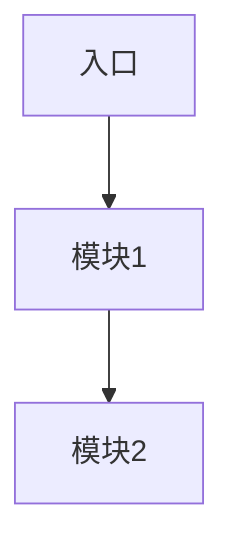

# Design — {{项目名}}

---
type: design
stage: 2
status: draft
---

## 设计理由（1 段）

## 架构草图

```mermaid
graph TD;
  A[入口] --> B[模块1];
  B --> C[模块2];
```

## 组件说明
| 组件 | 职责 | 依赖 |
|------|------|------|

## 数据模型 / 接口

## 备选方案与取舍
