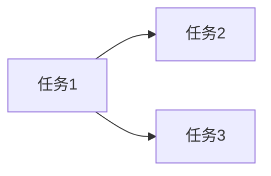

# Plan — {{项目名}}

---
type: plan
stage: 4
status: draft
---

## 任务图

```mermaid
graph LR;
  T1[任务1] --> T2[任务2];
  T1 --> T3[任务3];
```

## 任务清单
| # | 任务 | 依赖 | 估时 | 产出 |
|---|------|------|------|------|

## 并行边界
- 可并行：
- 串行依赖：

## 风险
